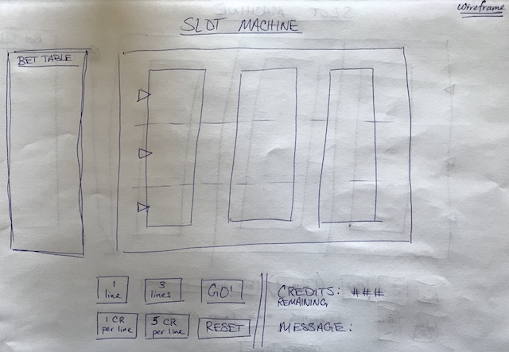
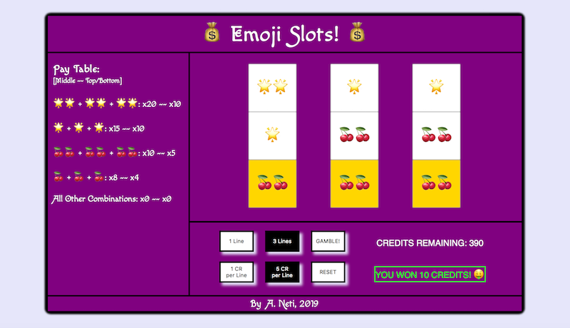

# SLOT MACHINE
Project 1 (Browser-Based Game)

## Background

A slot machine is a gambling machine which relies on chance to determine a win or loss. The machine takes credits or coins as input and outputs a scaled amount of coins if a certain "win" condition is met. There are usually three or more reels, which depict fruits or other popular symbols. In the simplest form, a win takes place when the same symbol (as depicted on the pay table) appears across a row. In this application, a player can keep playing until the credits run out (loss condition).

## Getting Started

You can access the game by clicking here: [Slot Machine](https://akhilnn.github.io/browser-based-game)

The game can be played by selecting the lines to bet, the credits per line, and hitting the GAMBLE! button. The credits will be automatically updated based on a win or loss. A reset button is available to restart the game. **NOTE**: The game has sound which will be played upon initial load, after each gamble, and upon a reset.

## Pseudocode

1. Define required constants
	1. Define a SYMBOLS object that defines the symbols that will be on each reel
	1. Define which three symbols will scale the value of a bet and store as an object property
1. Define required variables used to track the state of the game
	1. Define an array to represent each of the three active symbols on the reels
	1. Define a variable to keep track of a user’s credits (money)
	1. Define variables to store the player's betting options (1 CR per line, 5 CR per line, one bet line, three bet lines)
1. Store elements on the page that will be accessed in code more than once in variables to make code more concise, readable and performant
	1. Store each of the buttons used to play the game
	1. Store the elements used to display the remaining credits and any user message
1. Upon loading the app should:
	1. Initialize the state variables
		1. Initialize each of the three arrays to a starting value representing the initial symbols on the reel
		1. Initialize the user’s credits to 500
		1. Default the button values to false
	1. Render those values to the page
		1. Render the slot machine:
			1. Display a symbol to each of the 9 elements that will be displayed on the page
			1. Update the CREDITS REMAINING to the current credits value
		1. Render any messages:
			1. Display messages to indicate start of game and win/loss
	1. Wait for the user to click GAMBLE! to start game
1. Handle a player clicking the GAMBLE! button to start the slot machine:
	1. Check that the user’s total credits inserted are > 0
	1. Check that the appropriate bet option selections are made
		1. Check that the user has enough credits to make a bet
	1. Trigger a random generation function three times
		1. Randomly select an array index to determine which relative symbols are “active” on each of the reels
	1. Trigger an update credits function
		1. Calculate the reward based on the “pay table” for each of line of the reels
			1. Trigger an equality check function (for each selected row) that checks if all the elements in a given row are equal
			1. Scale the value of the input credits based on the “pay table” 
		1. Update the total credits of the user
	1. Render the slot machine after all states have been updated
1. Handle a player clicking on any of the bet option buttons:
	1. Set the appropriate variables based on the lines selected and credits per line allocated
	1. Render the active buttons with appropriate styling
1. Handle a player clicking the reset button:
	1. Initialize the state variables again and render the slot machine

## User Stories

1. As a player, I want to be able to select the lines & bet amounts and start a game.
1. As a player, I want to be able to play multiple games to increase my winnings.
1. As a player, I want to be able to see the resulting symbols/numbers displayed to confirm a win/loss.
1. As a player, I want to be able to know when I can no longer play (do not have sufficient credits).

## Wireframe of Main Screen

## Screenshots of Game

## Technologies Used

- HTML5
- CSS3
- JavaScript

## Next Steps

- Make the game page responsive across other browsers and mobile devices
- Add scrolling animation to the reels
- Add functionality to bet on cross lines

